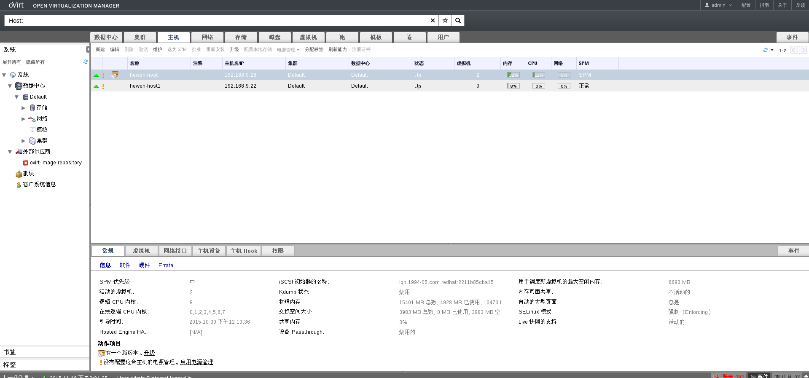
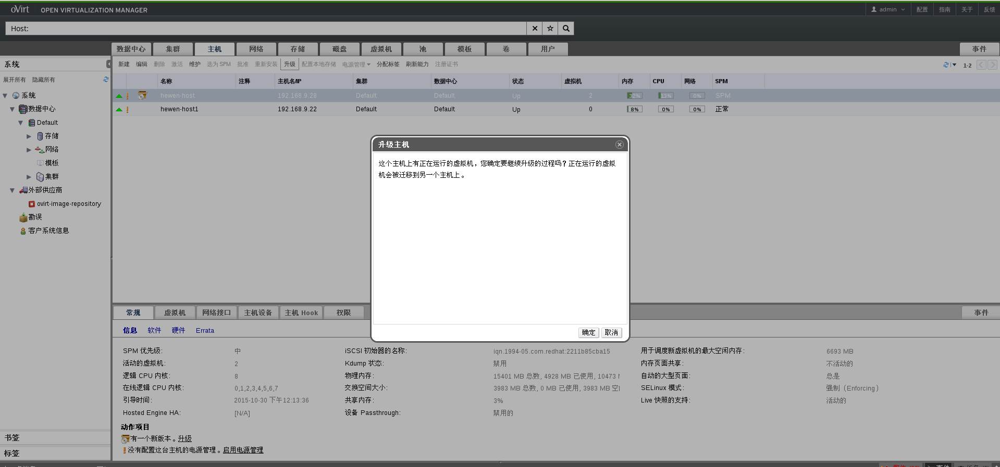
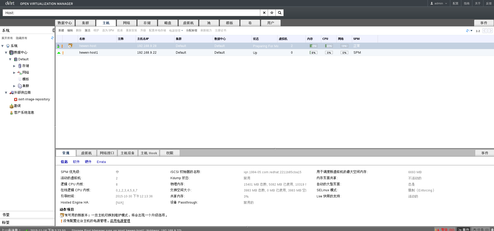
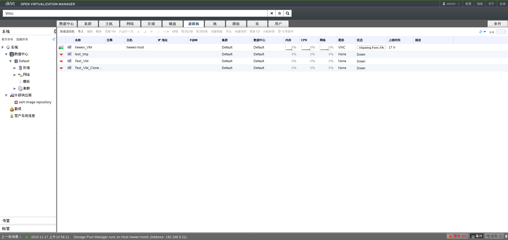
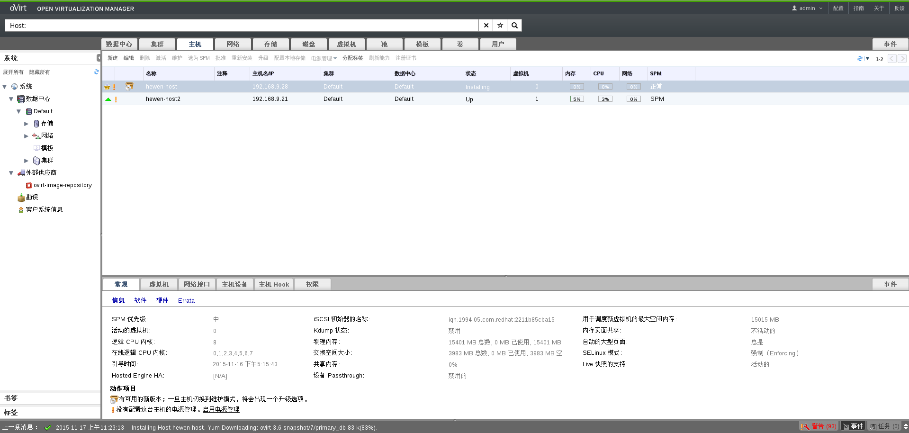
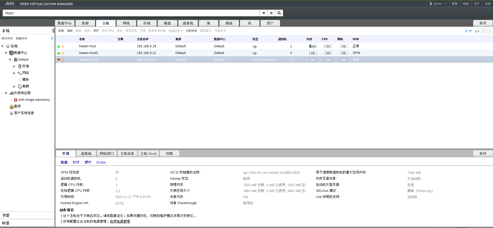

# 测试用例0030001

在ovirt3.6之前的版本中，升级集群中的主机是一个手动的过程。手动升级小的集群中的主
机还好。然而，如果需要升级大的集群中的所有主机是一件非常耗时的过程。在ovirt3.6中
添加了一项升级主机的新功能，新功能的目的就是让管理员知道集群中的主机什么时候可以
升级，同时可以使用新功能自动升级主机。此新功能的存在让升级主机在使用虚拟化的过程中变得较为简单。

##测试步骤

1.当虚拟化管理中心中有一台主机可以升级时，在详情面板底部的子标签中会出现一个警报，提示主机有一个新版本，其中**升级**链接到升级主机提示窗口。同时在菜单栏和主机上下文菜单栏中的**升级**按钮都会变成可用状态。如下图所示：

 

2.若要升级一台当前正在运行着虚拟机的主机，主机将被置为维护状态，运行在主机上的虚拟机将会自动迁移到集群中其它主机。如下图所示：

 

 

 

3.虚拟机移植完成之后将自动使用ovirt-host-deploy将新的更新安装在主机上面。如图所示：

 

4.主机升级之后将自动激活主机。如图所示：

 

至此，主机成功升级。
